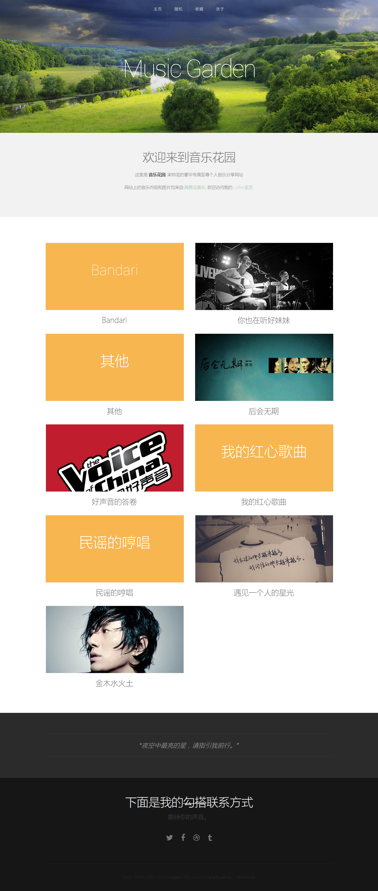

# MusicGarden

### Introduction
A music asset managment application developed for the DAM course in 2014.

### Technology
- Browswer end: HTML5, CSS3
- Server end: Node.js

### Author
Liang Shuailong(@handsome)

zju_shuailong@163.com

### Feature
1. Auto generate catelog page for songs files with 'mp3' format.
2. Support playing a random song in your song library.
3. Show similar songs in your song playing page.
4. Support customised album cover and category cover.

### TODO
- [x] 类别以及简介的自动生成
- [x] 异常处理（数据缺失、404错误等?）
- [x] 修复Footer缺失的BUG
- [x] 优化代码结构
- [x] END字符去掉
- [x] 相关推荐的实现
- [ ] HTML5 feature
- [ ] 其他格式图片的自动PNG转换
- [ ] 色块颜色随机化
- [ ] 播放列表

### Preview

